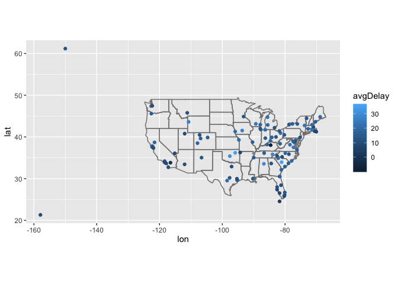
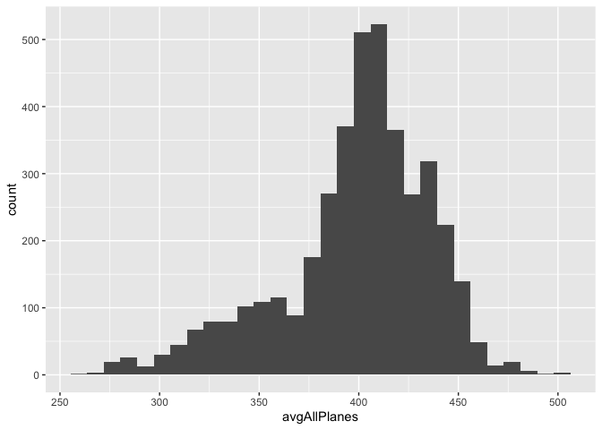

Midterm.
--------

\#install.packages(“maps”) \#\#\#\# 1. Map the delay by destination.

Compute the average delay by destination, then join on the airports data
frame so you can show the spatial distribution of delays. Here’s an easy
way to draw a map of the United States. You are welcome to use this code
or some other code.

    #flights
    #planes
    #airlines
    #airports
    #weather
    library(tidyverse)

    ## ── Attaching packages ─────────────────────────────────────── tidyverse 1.3.0 ──

    ## ✓ ggplot2 3.2.1     ✓ purrr   0.3.3
    ## ✓ tibble  2.1.3     ✓ dplyr   0.8.4
    ## ✓ tidyr   1.0.2     ✓ stringr 1.4.0
    ## ✓ readr   1.3.1     ✓ forcats 0.4.0

    ## ── Conflicts ────────────────────────────────────────── tidyverse_conflicts() ──
    ## x dplyr::filter() masks stats::filter()
    ## x dplyr::lag()    masks stats::lag()

    library(nycflights13)
    flights = nycflights13::flights

    flights2 = flights %>% group_by(dest) %>%
      summarize(avgDelay = mean(dep_delay, na.rm = TRUE)) 

    airports %>%
      right_join(flights2,c("faa" = "dest")) %>%
      ggplot(aes(lon, lat)) +
      borders("state")+ 
      geom_point(aes(colour = avgDelay)) +
      scale_size_area()+
      coord_quickmap()

    ## Warning: Removed 4 rows containing missing values (geom_point).

#### 2. Do planes trade ownership?

You might expect that there’s an implicit relationship between plane and
airline, because each plane is flown by a single airline. Confirm or
reject this conjecture using data.

This analysis shows that there are duplicated tailnums used by each
unique airline/tailnum pair. Therefore each plane is not flown by a
single airline so I reject this conjecture

    planes_unique = planes %>% left_join(flights, "tailnum")
    planes2 = planes_unique %>% select(carrier, tailnum) %>%
      distinct()
    planes2

    ## # A tibble: 3,339 x 2
    ##    carrier tailnum
    ##    <chr>   <chr>  
    ##  1 EV      N10156 
    ##  2 US      N102UW 
    ##  3 US      N103US 
    ##  4 US      N104UW 
    ##  5 EV      N10575 
    ##  6 US      N105UW 
    ##  7 US      N107US 
    ##  8 US      N108UW 
    ##  9 US      N109UW 
    ## 10 US      N110UW 
    ## # … with 3,329 more rows

    planes2$tailnum[duplicated(planes2$tailnum)]

    ##  [1] "N146PQ" "N153PQ" "N176PQ" "N181PQ" "N197PQ" "N200PQ" "N228PQ" "N232PQ"
    ##  [9] "N933AT" "N935AT" "N977AT" "N978AT" "N979AT" "N981AT" "N989AT" "N990AT"
    ## [17] "N994AT"

#### 3. Plane’s average speed.

Notice that `flights$air_time` is in minutes. Make a new column that is
the air time in hours.

    flights_1 = flights %>% mutate(air_timeHours = (air_time / 60))
    flights_1

    ## # A tibble: 336,776 x 20
    ##     year month   day dep_time sched_dep_time dep_delay arr_time sched_arr_time
    ##    <int> <int> <int>    <int>          <int>     <dbl>    <int>          <int>
    ##  1  2013     1     1      517            515         2      830            819
    ##  2  2013     1     1      533            529         4      850            830
    ##  3  2013     1     1      542            540         2      923            850
    ##  4  2013     1     1      544            545        -1     1004           1022
    ##  5  2013     1     1      554            600        -6      812            837
    ##  6  2013     1     1      554            558        -4      740            728
    ##  7  2013     1     1      555            600        -5      913            854
    ##  8  2013     1     1      557            600        -3      709            723
    ##  9  2013     1     1      557            600        -3      838            846
    ## 10  2013     1     1      558            600        -2      753            745
    ## # … with 336,766 more rows, and 12 more variables: arr_delay <dbl>,
    ## #   carrier <chr>, flight <int>, tailnum <chr>, origin <chr>, dest <chr>,
    ## #   air_time <dbl>, distance <dbl>, hour <dbl>, minute <dbl>, time_hour <dttm>,
    ## #   air_timeHours <dbl>

#### 4. Average speed

For each flight, compute the average speed of that flight (in miles per
hour). Then, for each plane, compute the average of those average
speeds. Display it in a histogram. You can use a base R histogram `hist`
or ggplot’s `geom_histogram`.

    flights_1 %>% mutate(avgSpeed = distance/air_timeHours)%>%
      group_by(tailnum)%>%
      summarize(avgAllPlanes = mean(avgSpeed, na.rm=TRUE)) %>%
      ggplot(aes(avgAllPlanes))+
      geom_histogram()

    ## `stat_bin()` using `bins = 30`. Pick better value with `binwidth`.

    ## Warning: Removed 7 rows containing non-finite values (stat_bin).

#### 5. What correlates with average speed?

To examine if there is anything in the plane data that correlates with
average speed, use `geom_boxplot` with average speed of the plane (in
previous question) on the y-axis and `planes$engine` on the x-axis. Do
the same for `planes$engines` and `planes$type`.

    # put answer here

PLEASE REMEMBER TO ALSO COMMIT AND PUSH YOUR FIGURES!!!
